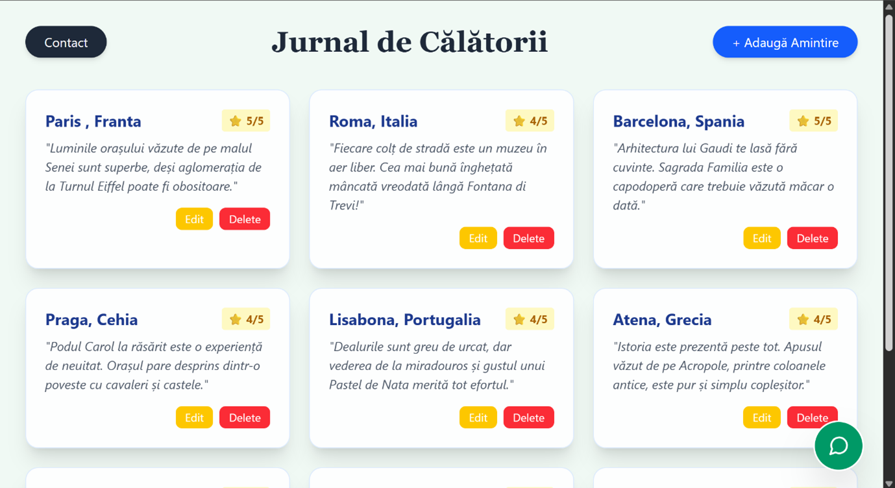
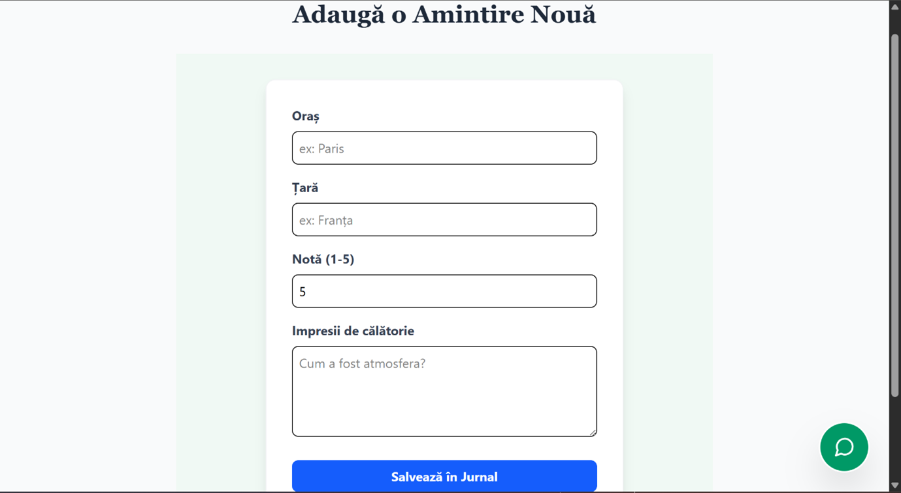
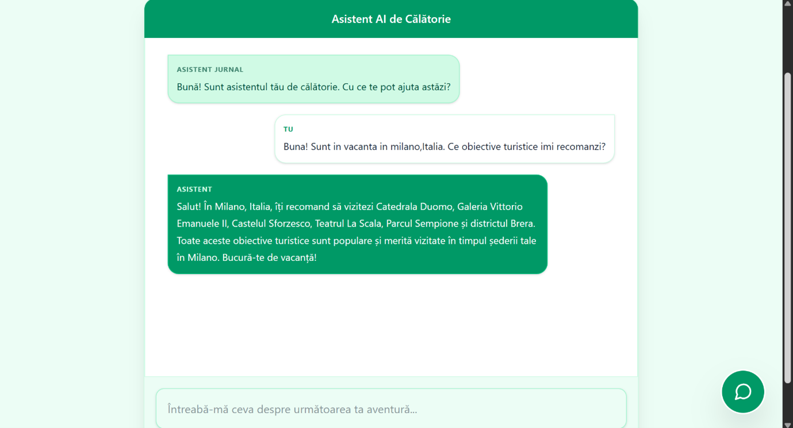
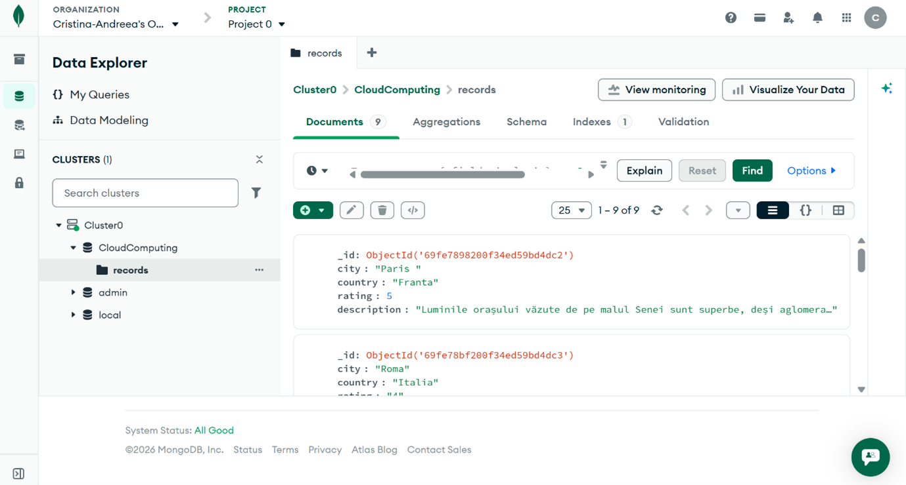
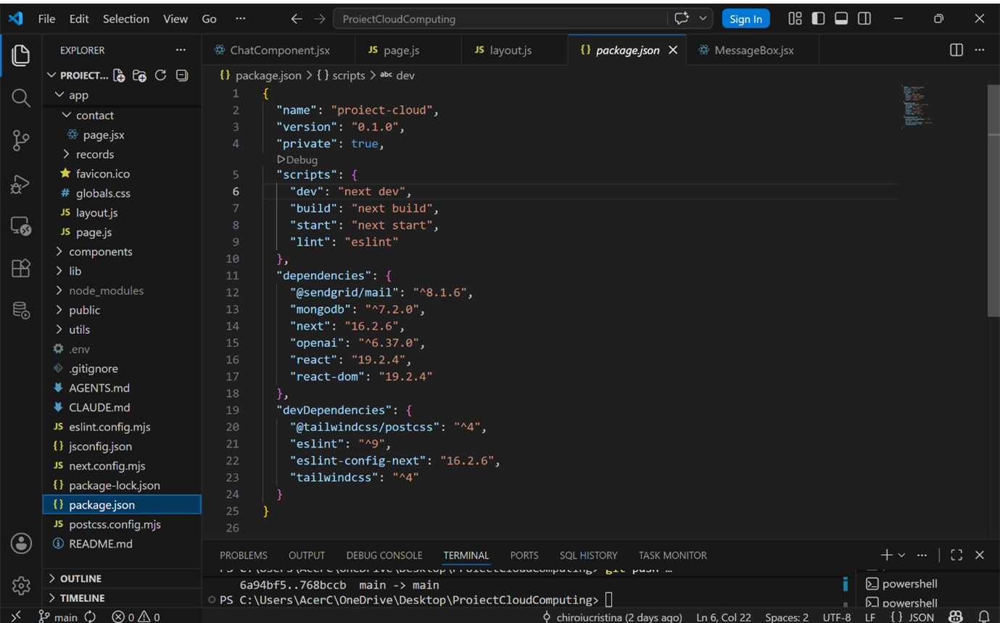
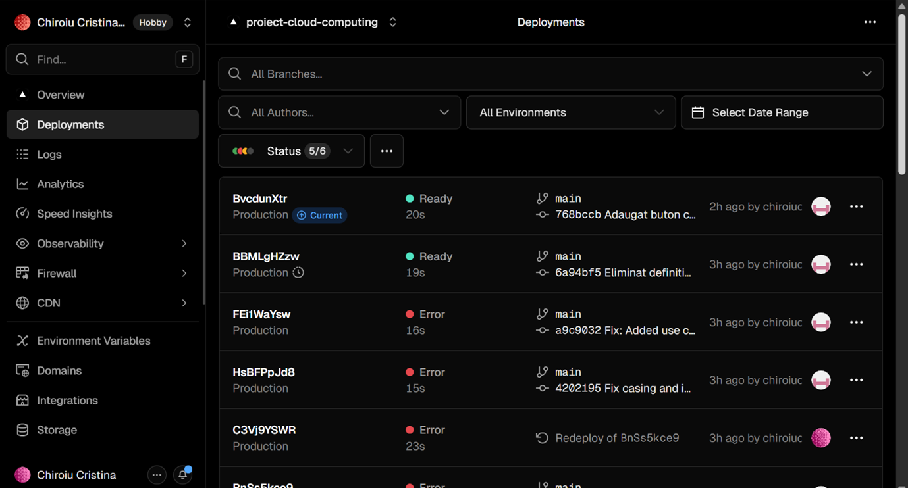
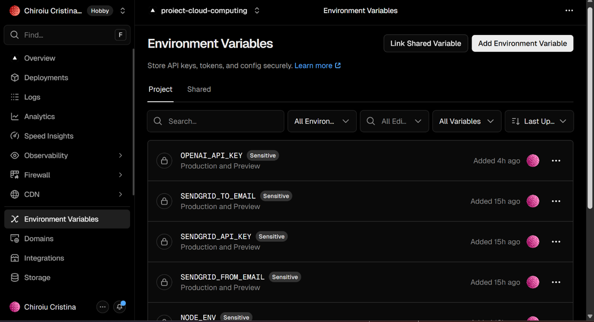
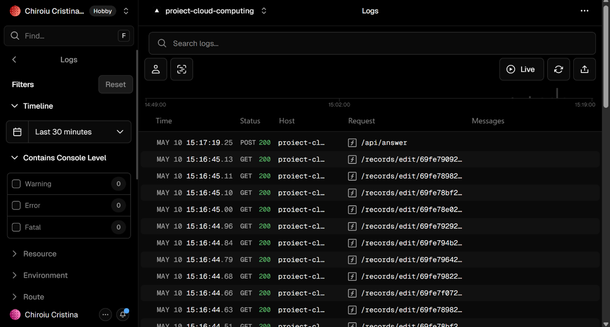

# Proiect Cloud Computing - Jurnal de Călătorii 

**Nume Prenume:** Chiroiu Cristina
**Grupa:** 1145

---

## 🔗 Link-uri Proiect
* **Video Prezentare (YouTube):** https://youtu.be/qC130Y3OVxA
* **Platformă Live (Vercel):** https://proiect-cloud-computing-mu.vercel.app/ 
* **Cod Sursă (GitHub):** https://github.com/chiroiucristina/ProiectCloudComputing 

---

## 1. Introducere
Aplicația "Jurnal de Călătorii" este o platformă web modernă destinată turiștilor, oferind funcționalități de gestionare a experiențelor personale și asistență bazată pe Inteligență Artificială pentru planificarea vacanțelor.

## 2. Descriere problemă (0.25p)
Aplicația "Jurnal de Călătorii" rezolvă nevoia turiștilor de a-și centraliza experiențele într-un format digital și de a primi asistență instantanee pentru planificarea viitoarelor vacanțe. Proiectul oferă o interfață intuitivă pentru salvarea amintirilor, un formular de contact pentru suport și un chatbot bazat pe Inteligență Artificială pentru recomandări personalizate.

## 3. Descriere API (0.25p)
Din punct de vedere teoretic, aplicația utilizează o arhitectură bazată pe API-uri REST (Representational State Transfer) pentru a comunica cu serviciile externe în mod stateless. În loc să gestionăm propria infrastructură de procesare a limbajului natural sau de trimitere a mail-urilor, am delegat aceste sarcini către furnizori de tip SaaS (Software as a Service).
* **OpenAI API:** Expune un endpoint de tip chat/completions. Practic, în fișierul app/api/answer/route.js, am configurat un server-side route care preia input-ul utilizatorului și îl trimite către modelul gpt-3.5-turbo.
* **SendGrid API:** Un serviciu de tip Email-as-a-Service. Implementarea permite aplicației să trimită e-mailuri programatice fără a configura un server SMTP propriu.
* **MongoDB Atlas API:** : Deși baza de date este accesată printr-un driver (Mongoose/MongoDB library), interfața de administrare Atlas funcționează ca un punct centralizat de gestionare a datelor în cloud.

## 4. Flux de date (0.25p)
Aplicația urmează un flux Client-Server. Browserul trimite cereri HTTP, serverul Next.js le prelucrează și comunică securizat cu serviciile Cloud.

* **Metode HTTP:** Am utilizat **POST** pentru trimiterea datelor către AI și SendGrid, și operații **CRUD** (GET, POST, PUT, DELETE) pentru gestionarea jurnalului în MongoDB.
* **Autentificare:** Toate serviciile sunt securizate prin **Environment Variables** configurate în Vercel, astfel încât cheile API să nu fie expuse în codul public.
* **Exemplu Request/Response (OpenAI):**
  - **Request:** `POST /api/answer` cu body `{ "messages": [...] }`
  - **Response:** `200 OK` cu textul generat de AI.

---

## 5. Capturi ecran aplicație (0.25p)

### 1. Interfața principală (Home)

*Pagina principală a aplicației Jurnal de Călătorii, unde sunt afișate destinațiile salvate sub formă de carduri interactive, extrase dinamic din baza de date MongoDB Atlas.*

### 2. Adăugare Amintire (Formular)

*Interfața de colectare a datelor (formular), unde utilizatorul introduce detaliile călătoriei. Datele sunt trimise printr-o cerere POST către backend și salvate ulterior în cloud.*

### 3. Asistent AI (Chatbot)

*Interfața chatbot-ului integrat, care utilizează OpenAI API pentru a oferi recomandări de călătorie personalizate și răspunsuri în timp real utilizatorilor.*

### 4. Persistența datelor (MongoDB Atlas)

*Vizualizarea colecției de date în MongoDB Atlas, demonstrând stocarea persistentă în cloud a informațiilor introduse de utilizator prin interfața aplicației.*

### 5. Dependențe Proiect (package.json)

*Vizualizarea fișierului package.json în VS Code, unde sunt evidențiate bibliotecile utilizate pentru integrarea serviciilor cloud: @sendgrid/mail pentru e-mail, mongodb pentru baza de date și openai pentru asistentul virtual, alături de framework-ul Next.js*

### 6. Publicarea aplicației (Vercel)

*Panoul de control Vercel care confirmă deployment-ul reușit al aplicației în cloud și oferă link-ul public de acces (URL-ul live).*

### 7. Securitate (Environment Variables)

*Configurarea variabilelor de mediu în platforma Vercel pentru stocarea securizată a cheilor API, evitând expunerea acestora în codul sursă de pe GitHub.*

### 8. Monitorizare (Vercel Logs)

*Sistemul de monitorizare (Logs) din Vercel, care evidențiază traficul în timp real și statusul cererilor HTTP (200 OK). Această captură demonstrează funcționarea corectă a endpoint-urilor de API.*

---

## 6. Referințe
* [Next.js Documentation](https://nextjs.org/docs)
* [OpenAI API Reference](https://platform.openai.com/docs/)
* [MongoDB Atlas Documentation](https://www.mongodb.com/docs/atlas/)